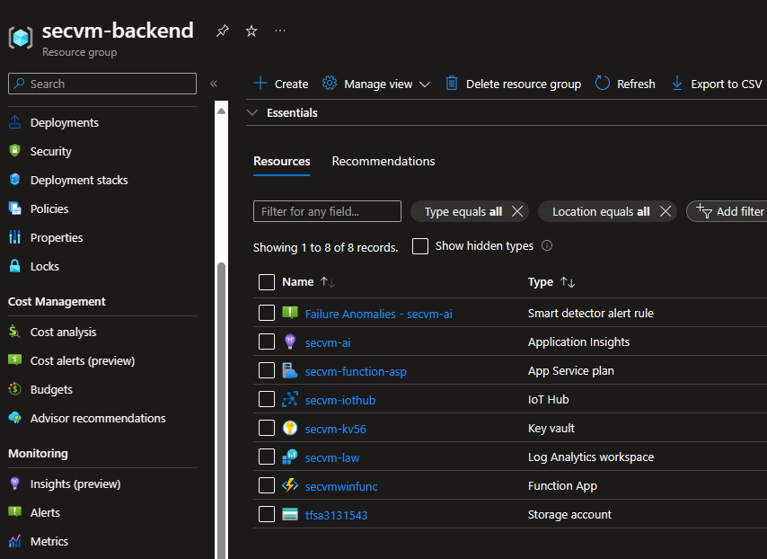
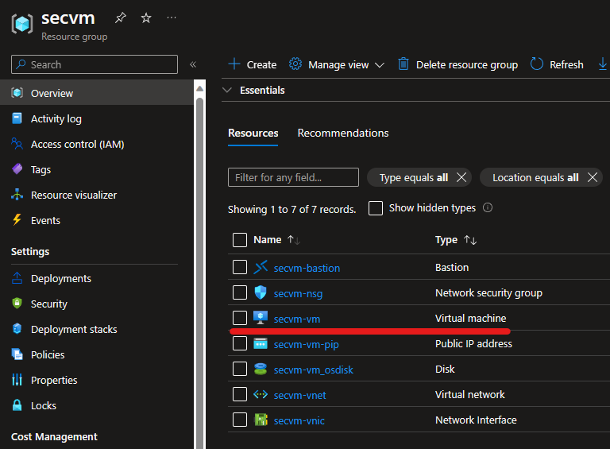
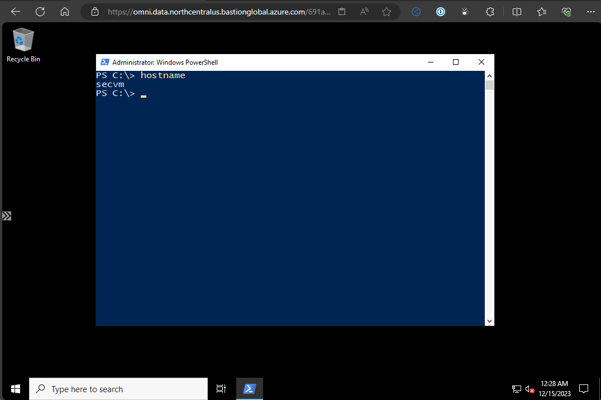

# Azure Automation Integration Demo

An example project demonstrating how integrations can be used to run cloud automation.

1. [Overview](#overview)
2. [Initial Setup](#initialsetup)
3. [Backend Setup](#backendsetup)
4. [VM Deployment](#vmdeployment)

## Overview 

In this a quick and dirty demonstration using a physical IoT Wifi button sending HTTP calls that interact with Azure-built automation in order to trigger the creation of a VM I will use for my security tasks. IoT buttons used in this way would not benefit most organizations in production workflows. This is merely a fun demonstration of how automation can easily be kicked off to do a whole host of different tasks. 

There are many ways to integrate with automation. The most functional (in my opinion) are ticketing or ITSM systems that help orchestrate workflows which can then be connected via simple HTTP calls to cloud automation. Examples of tasks that can be automated in this way:

- Building resources
- Onboarding users
- Assigning licenses
- Updating staff information
- Monotonous support tasks to free up Help Desk staff

This project will use the following technologies:
- GitHub Actions
- TeXXmo IoT Wifi Button
- PowerShell 7.2
- Terraform
- Ansible
- Microsoft Azure
    - Application Insights
    - Bastion
    - Entra App Registration    
    - Function Apps    
    - IoT Hub
    - Key Vault
    - Log Analytics Workspace
    - Network Security Group
    - Storage Account
    - Virtual Network
    - Virtual Machine

> I purposely left certain information exposed in the Action logs so people can see more details for learning purposes. I have already remove or updated all of the Azure resources, IPs, and other pieces of data. 

## Initial Setup 

> These initial tasks just need to be run once at the very beginning of the project in order to set up some dependencies.

- Make sure the following tools are installed on your local machine:
    - [Azure CLI](https://learn.microsoft.com/en-us/cli/azure/install-azure-cli)
    - [GitHub CLI](https://github.com/cli/cli#installation)
    - [PowerShell](https://learn.microsoft.com/en-us/powershell/scripting/install/installing-powershell?view=powershell-7.4)

- In your Azure Subscription, create an [Entra App Registration Service Principal](https://learn.microsoft.com/en-us/entra/identity-platform/quickstart-register-app). Give that service principal proper access in your subscription to build resources and add resources to Azure role assignments.

- Fork this GitHub repo to your own GitHub account. 

- In your GitHub account, setup a classic [Personal Access Token (PAT)](https://docs.github.com/en/authentication/keeping-your-account-and-data-secure/managing-your-personal-access-tokens#creating-a-personal-access-token-classic). The following scopes must be defines on the token when created:
    - Repo (all)
    - Read:org
    - Read:user

- Gather the following information below:
    - Entra ID App Registration client ID
    - Entra ID App Registration client secret
    - Entra Tenant ID
    - Azure Subscription Id
    - Username you would like to use for the VM we will create
    - Password you would like to use for the VM we will create
    - The Personal Access Token (PAT) for your GitHub account
    - A string of your choice that will be used by the IoT device sent to the Azure Function that will work like a claim password

- An initial Resource Group and Storage Account will need to be created in order to hold the Terraform state files. We will also need to populate your GitHub Repo with needed Action Secrets and Variables. Use the PowerShell script [initial_setup.ps1](https://github.com/CityHallin/azure_cityhallin_secvm/blob/main/1-setup/initial_setup.ps1) to help with this process. The script will ask for you to enter the information you saved above. It will then prompt you to create the initial Azure and Github resources. For the GitHub portion, it will ask you to log into your GitHub account. The recommendation is to use HTTP, select "N" for Git authentication, and use your PAT you created earlier. 

## Backend Setup 

> These backend steps just need to be run once in order to setup the automation infrastructure. 

- Once the initial setup is complete, go into your GitHub account > your forked repo > Actions > click on [Deploy Backend Security VM Infrastructure](https://github.com/CityHallin/azure_cityhallin_secvm/actions/workflows/secvm_backend_deployment.yml). Click on the **Run Workflow** button on the right and select **Run Workflow**. This will create all of the backend resources for you. 
The Deploy Backend Security VM Infrastructure GitHub Action will take about 4-6 minutes to run and complete setting up all of the needed backend infrastructure. 

 

- Once finished, you should see a new Resource Group called **secvm_backend** with all of your backend resources ready to go. 

 

- In your Azure Subscription, navigate to your IoT Hub resource and copy down the following information that will be used to configure your TeXXmo IoT physical device:
    - Azure IoT Hub FQDN Hostname
    - Azure IoT Hub Device Name
    - Azure IoT Hub Device Primary Key
    - IoT Claim Password added earlier in the process (this can be fetched from your GitHub Action Secrets or Azure Key Vault). This will be used in the JSON body of the HTTP call to the Azure Function. 

## VM Deployment 

 

- Once the IoT button device is configured with your Azure IoT Hub information, we are ready to build our security VM from the literal push of a button.
    - Click the IoT button which will use your Wifi and send an HTTP event to the Azure IoT Hub. 
    - The Azure Function App will be monitoring an event service on the IoT Hub. Once it sees a new event from the IoT device, that will trigger the Azure Function. 
    - The Azure Function checks the claim password sent by the IoT device is correct and then sends a webhook to the [Deploy Security VM](https://github.com/CityHallin/azure_cityhallin_secvm/actions/workflows/secvm_deployment1.yml) GitHub Action in your forked GitHub repo.
    - The Deploy Security VM GitHub Action uses Terraform and Ansible to deploy the VM, configures the VM and an Azure Bastion service to remotely access the VM. 

- Since this is using Infrastructure as code (IaC), any future button clicks will just enforce everything for the VM is configured correctly via [Idempotence](https://learn.microsoft.com/en-us/devops/deliver/what-is-infrastructure-as-code#avoid-manual-configuration-to-enforce-consistency). If nothing needs to change, the automation does not do anything. 

- If the VM is no longer needed, just the VM can be deleted in the Azure portal to save on cost. Once the VM is needed again, click the IoT button. The **Deploy Security VM** GitHub Action will only re-create VM resources that are not there. 

 

 